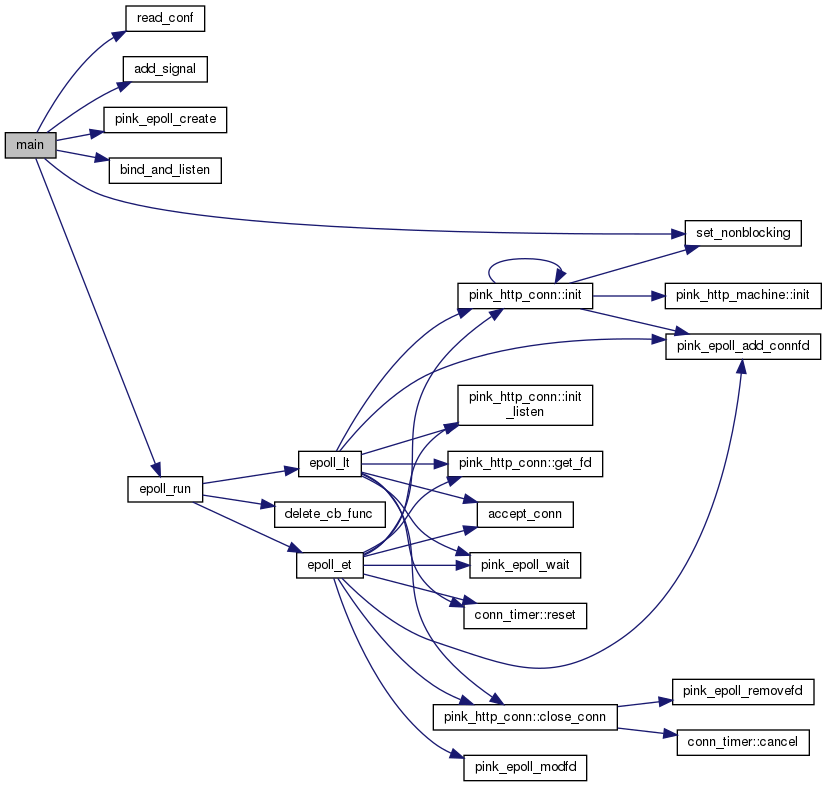
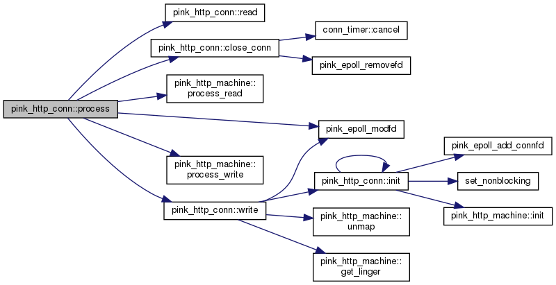

## 架构与模块

**Preview: 基于 Reactor 的半同步/半异步并发模式 + 同步 epoll (ET) 事件循环 + 多线程 (线程池)**

---

#### 整体结构与详细工作流

---

### 各大模块

#### 1. Epoll 事件循环

**pink_epoll.h|cpp + tools/pink_epoll_tool.h|cpp**

在整体架构中，epoll 属于同步的部分，由主线程同步运行。

- **结构**

1. 采用 ET 模式。（同时实现了 LT 模式。）

2. 注册的事件类型: （1）新连接请求到来（2）连接socket上读就绪（3）连接socket上写就绪

3. 只负责接受连接，分发读取/写出任务，以及定时器超时任务。

4. 定期处理超时事件: 目前每5秒。

#### 2. 连接池

**pink_conn_pool.h**

为了节约连接体申请内存的时间开销，采用连接池进行优化。

- **结构**

1. 通过预先分配 pre_conn_number 个连接体来构建连接池。

2. 核心: list<T*> conn_lst 连接体指针链表。

3. 每次从表头获取连接体指针（即原先的 new），每次归还连接体指针到表尾（即原先的 delete）。

- **题外话**

1. 一开始实现连接池时，打算用连接体数组，并搭配最小堆来存放连接体下标，每次分配最小可用下标的连接体 O(logK)。分配连接的时间效率肯定不如现在的链表形式 O(1)。但是最小堆的内存局部性更强。

2. 实际上直接用连接体数组，并用 fd 来直接做下标也是可行的。但总觉得不够优雅。

#### 3. 时间堆

**pink_conn_timer.h + pink_epoll.h|cpp**

- **结构**

1. 采用自实现的最小堆，存放定时器的指针。

2. 每次处理时不断从顶部取出定时器，并判断是否超时。

3. 删除定时器采用懒惰删除，给定时器打上 cancled 标签。

#### 4. 线程池

**pink_thread_pool.h**

- **结构**

1. **半同步/半反应堆模式**，工作队列(**同步**)负责任务获取与分发，工作线程(**异步**)负责处理任务。

2. 工作队列: list<pair<T*, int>>，每个任务包含结构体和一个标签 flag，用于标记 READ/WRITE 任务。

3. 工作线程: shared_ptr<pthread_t> threads，线程线程标识符数组，预分配大小。

- **优点**

1. 以空间换取时间效率。

2. 线程池适用于高并发多线程，但每个线程运行时间较短的情况。

3. 通用性高，比较 general，采用模板元编程。

- **限制**

1. 要求客户请求都是无状态的，同一个连接上的不同请求可能由不同的线程处理。

2. 容易产生惊群效应，需要特殊处理。

#### 5. 工作线程

1. 工作线程取出读取/写出任务后，回调 HTTP 连接类的 process() 函数。

2. 回调一次 process() 函数负责:

（1）从内核缓冲区读取数据到用户缓冲区: 非阻塞 read，(遇到 EAGAIN 则返回)

（2）处理 HTTP 请求报文

（3）构建 HTTP 响应报文

（4）把响应报文写入到内核缓冲区: 非阻塞 write，（遇到 EAGAIN 则返回）

3. **如果能一次性处理完则不再通知 epoll**

---

### Call graph

**主调用框架**

- delete_cb_func() 为定时器超时事件的 callback 函数（关闭超时连接）。

**工作线程的运行函数 process() 调用框架**

- pink_http_conn 连接类中的成员变量 machine 为 HTTP 解析状态机，用于解析请求和构建响应。

- 静态文件请求利用 mmap()/munmap() 系统调用实现。

---
