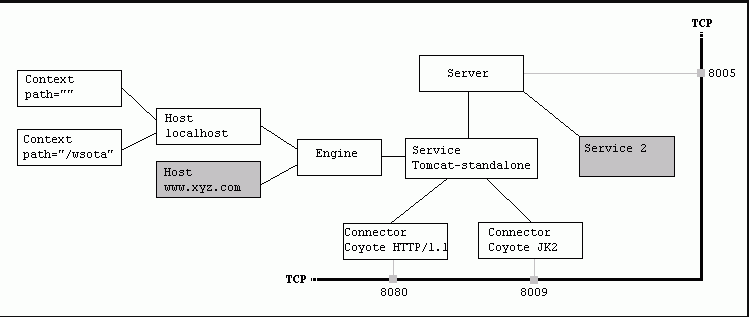
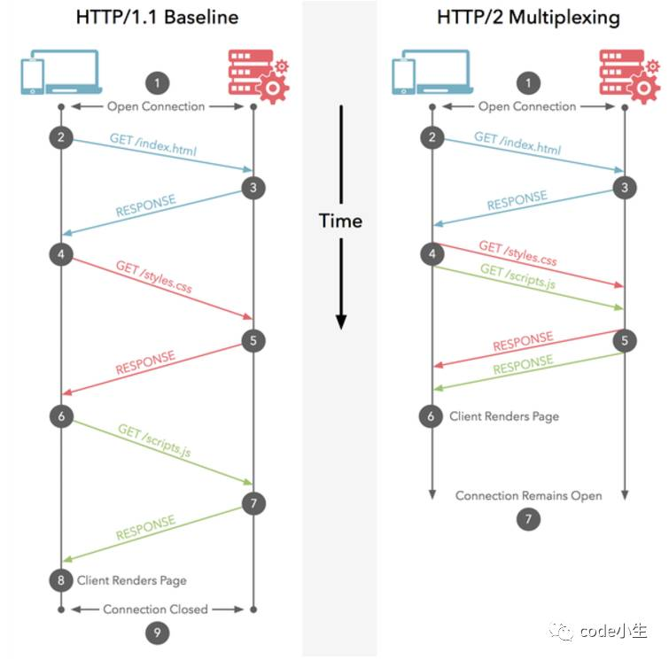

## 基础知识

---

#### 服务器并发模式分析

**1. 单进程多线程模式**

通过在单进程内创建线程池，使工作线程异步并行地为客户的请求服务。

**优点：**

（1）工作线程之间数据共享方便（全局、静态变量）。

（2）线程的上下文切换开销较小（不切换地址空间，不刷新 TLB，只修改部分 CPU 寄存器），善于处理高并发。

（3）线程创建速度较快。

**缺点：**

（1）一个线程挂了，其他线程也就挂了。（虽然能写守护进程来重启，但是会有宕机期。）

（2）编程时需要考虑资源的同步问题，稍显复杂。

**2. 多进程单线程模式**

**优点：**

（1）一个进程崩溃可以被 master 重启，并不会使整个服务器挂掉。因此 master 安全隔离了工作进程。

（2）数据隔离和错误隔离。

（3）编程相对简单，通常不同考虑资源同步的问题。

**缺点：**

（1）进程切换开销大，对高并发的处理能力不如多线程模式。

**3. 多进程多线程模式**

在每个子进程内开多个线程。在支持高并发的情况下，避免了单进程多线程的宕机问题。

**4. Pink server 的模式**

目前的 Pink 为单进程多线程模式（更像单进程版的 Apache event MPM 模式）。实现这个模式一是为了熟悉多线程编程、资源同步方式，二是觉得从多线程到多进程的过度相对容易。（下一个 server 实现多进程。）

---

#### 主流的 Web 服务器分析

**1. Apache**

Apache 有三种稳定的 MPM（multi-processing module），即多进程处理模块。分别是 prefork、worker和 event。

（1）prefork（Linux 下的默认模式）

很古老但十分稳定。通过预先 fork 一些子进程等待请求。一个子进程一个线程，处理一个请求。

优点：不需要考虑线程安全问题。成熟稳定。

缺点：子进程数量有上限，不能 handle 高并发的情况。进程的内存开销大。

（2）worker

在 prefork 的基础上，每个子进程中创建多个线程。（这里使用多进程是为了服务器的稳定性。）

优点：高并发下比 prefork 更优秀，占据更少内存。

缺点：由于用了多线程，则需要考虑线程安全问题。

（3）event

把工作线程和连接分离开来，从而解决 keep-alive 连接总是占据一个工作线程的问题。以事件的形式触发线程。（基于 linux epoll）

优点：处理了 keep-alive 连接的情况。更高的并发量。事件驱动使得更适合于 IO 密集型服务。

缺点：对于 HTTPS 连接，仍然是类似 worker 模式，线程会一直被占用的。

**2. Tomcat**

Tomcat 服务器是一个免费的开放源代码的Web 应用服务器，属于轻量级应用服务器。由于技术先进、性能稳定，而且免费，因而深受Java 爱好者的喜爱并得到了部分软件开发商的认可，成为目前比较流行的 Web 应用服务器。

实际上Tomcat是Apache 服务器的扩展，但运行时它是独立运行的，所以当你运行tomcat 时，它实际上作为一个与Apache 独立的进程单独运行的。




**3. NginX**

参考1：https://www.jianshu.com/p/a253d21e4b16

参考2（阿里云天基blog）：http://tengine.taobao.org/book/#id4

轻量级的异步非阻塞高性能 HTTP/ 反向代理 服务器。（也可以作为邮件服务器）

**1. Structure:**


（1）多进程单线程模式

（2）大部分 event 采用 ET epoll 事件驱动，监听 socket 为 LT 模式。

**1.5 Nginx 信号详解**

（1）**Reload 重载配置**

作用：给 master 发送 SIGHUP 信号，让其重启一批新的 worker/cache 子进程（优雅关闭老的子进程）。

  - nginx -s reload

  - kill -SIGHUP [master-pid]

（2）**直接终止 master 进程**

作用：终止整个 nginx

  - nginx -s stop

  - kill -SIGTERM [master-pid]

（3）**优雅终止 master 进程**

作用：优雅终止整个 nginx

  - nginx -s quit

  - kill -SIGQUIT [master-pid]

（4）**（优雅）终止 worker 进程**

作用：给 worker 发送 SIGTERM/SIGQUIT 信号，使其退出（并给 maste 发送 CHILD 信号），master 会重新拉起一个新的 worker 进程。

  - kill -SIGTERM [worker-pid]

  - kill -SIGQUIT [worker-pid] # 优雅终止

（5）**重新打开日志文件**

作用：日志切割，可以先把原日志文件 mv 走（但此时 nginx 还是在写入这个文件，因为还有该文件的 inode 信息），然后再重开日志文件，作为新日志文件。**可以写成 bash 脚本。**

  - nginx -s reopen

  - kill -USR1 [master-pid]

（6）**平滑升级 nginx**

作用：老 master 创建新 master （子进程），并停止监听，所有新请求将由新 master 和新 worker 来处理。但是老 master 和老 worker 依然存在。

  - kill -USR2 [old-master-pid]

下一步，优雅关闭所有老 worker：

  - kill -WINCH [old-master-pid]

此时，老的 nginx 只剩一个老 master 进程，用来回滚（向老 master 发送 HUP，向新 master 发送 QUIT。）


**2. Work flow:**

（1）master进程会接收来自外界发来的信号，再根据信号做不同的事情。

（2）在master进程里面，先建立好 listenfd 之后，然后再 fork 出多个 worker 进程。

（3）为保证只有一个进程处理该连接，所有 worker 进程事先抢 accept_mutex，抢到互斥锁的那个进程注册 listenfd 读事件，在读事件里调用 accept 接受该连接。

（4）worker 读取请求，解析请求，处理请求，产生数据后，再返回给客户端，最后才断开连接一个请求，完全由 worker 进程来处理，而且只在一个 worker 进程中处理。（worker 进程之间互不影响。）

（5）

**3. Features:**

（1) 多进程单线程。

（2）支持热升级。


**4. Components:**

（1）ngx_connection_t

对tcp连接的封装，其中包括连接的socket，读事件，写事件。建立连接，发送与接受数据。

（2）ngx_http_request_t

对一个http请求的封装。

（3）ngx_pool_t

Nginx 内存/文件池，提供了一种机制，帮助管理一系列的资源（如内存，文件等），使得对这些资源的使用和释放统一进行，免除了使用过程中考虑到对各种各样资源的什么时候释放，是否遗漏了释放的担心。

  - （i）对于内存，进行池化管理。

  - （ii）对于文件，统一登记到 ngx_pool_t 对象中，在对象销毁时释放（关闭文件）。

**具体定义：**

```cpp
typedef struct ngx_pool_s        ngx_pool_t;

struct ngx_pool_s {
    ngx_pool_data_t       d;         //
    size_t                max;
    ngx_pool_t           *current;
    ngx_chain_t          *chain;
    ngx_pool_large_t     *large;
    ngx_pool_cleanup_t   *cleanup;
    ngx_log_t            *log;
};
```


（4）ngx_array_t

ngx_hash_t

ngx_hash_wildcard_t

ngx_hash_combined_t

ngx_hash_keys_arrays_t

ngx_chain_t

ngx_buf_t

ngx_list_t

ngx_queue_t

nginx.conf


**5. Advantages:**

（1）轻量级，比 apache 占用更少的内存资源。

（2）高度模块化的设计。

（3）性能强大，静态处理性能比 apache 高三倍以上。


---

#### HTTP 1.0、HTTP 1.1、HTTP 2.0

参考1：https://www.cnblogs.com/heluan/p/8620312.html

1. HTTP 1.0（1996)

2. HTTP 1.1（1999)

比 1.0 版本多了：

（1）**缓存处理**，在HTTP1.0中主要使用header里的If-Modified-Since,Expires来做为缓存判断的标准，HTTP1.1则引入了更多的缓存控制策略例如Entity tag，If-Unmodified-Since, If-Match, If-None-Match等更多可供选择的**缓存头**来控制缓存策略。

（2）**带宽优化及网络连接的使用**，HTTP1.0中，存在一些浪费带宽的现象，例如客户端只是需要某个对象的一部分，而服务器却将整个对象送过来了，并且**不支持断点续传**功能，HTTP1.1则在请求头引入了**range头域**，它允许只请求资源的某个部分，即返回码是206（Partial Content），这样就方便了开发者自由的选择以便于充分利用带宽和连接。

（3）**错误通知的管理**，在HTTP1.1中新增了24个**错误状态响应码**，如409（Conflict）表示请求的资源与资源的当前状态发生冲突；410（Gone）表示服务器上的某个资源被永久性的删除。

（4）**Host头处理**，在HTTP1.0中认为每台服务器都绑定一个唯一的IP地址，因此，请求消息中的URL并没有传递主机名（hostname）。但随着虚拟主机技术的发展，在一台物理服务器上可以存在多个虚拟主机（Multi-homed Web Servers），并且它们共享一个IP地址。HTTP1.1的请求消息和响应消息都应支持Host头域，且**请求消息中如果没有Host头域会报告一个错误**（400 Bad Request）。

（5）**长连接**，HTTP 1.1支持长连接（PersistentConnection）和请求的流水线（Pipelining）处理，在一个TCP连接上可以传送多个HTTP请求和响应，减少了建立和关闭连接的消耗和延迟，在HTTP1.1中默认开启**Connection： keep-alive**，一定程度上弥补了HTTP1.0每次请求都要创建连接的缺点。

3. HTTP 2.0（2015）

基于 google 2012 年提出的 SPDY 设计的。

（1）**新的二进制格式（Binary Format）**，HTTP1.x的解析是基于文本。基于文本协议的格式解析存在天然缺陷，文本的表现形式有多样性，要做到健壮性考虑的场景必然很多，二进制则不同，只认0和1的组合。基于这种考虑HTTP2.0的协议解析决定采用二进制格式，实现方便且健壮。

（2）**多路复用（MultiPlexing）**，即连接共享，即每一个request都是是用作连接共享机制的。一个request对应一个id，这样一个连接上可以有多个request，每个连接的request可以随机的混杂在一起，接收方可以根据request的 id将request再归属到各自不同的服务端请求里面。(**More**: HTTP/2引入二进制数据帧和流的概念，其中帧对数据进行顺序标识，如下图所示，这样浏览器收到数据之后，就可以按照序列对数据进行合并，而不会出现合并后数据错乱的情况。)

（3）**header压缩**，如上文中所言，对前面提到过HTTP1.x的header带有大量信息，而且每次都要重复发送，HTTP2.0使用encoder来减少需要传输的header大小，通讯双方各自cache一份header fields表，既避免了重复header的传输，又减小了需要传输的大小。

（4）**服务端推送（server push）**，实现了类似SPDY的功能：采用了SPDY的网页，例如我的网页有一个sytle.css的请求，在客户端收到sytle.css数据的同时，服务端会将sytle.js的文件推送给客户端，当客户端再次尝试获取sytle.js时就可以直接从缓存中获取到，不用再发请求了。

**多路复用带来的优化：**

HTTP 性能优化的关键并不在于高带宽，而是低延迟。TCP 连接会随着时间进行自我「调谐」，起初会限制连接的最大速度，如果数据成功传输，会随着时间的推移提高传输的速度。这种调谐则被称为 TCP 慢启动。由于这种原因，让原本就具有突发性和短时性的 HTTP 连接变的十分低效。
HTTP/2 通过让所有数据流共用同一个连接，可以更有效地使用 TCP 连接，让高带宽也能真正的服务于 HTTP 的性能提升。



---

#### HTTP Web 服务器基础概念


（1）建立连接

（2）接收请求（从网络中读取HTTP请求报文）

（3）处理请求（对请求报文进行解释，并采取行动）

（4）访问资源（访问报文中指定的资源）

（5）构建响应（创建带有正确首部的HTTP响应报文）

（6）发送响应（将响应回送给客户端）

（7）记录事务处理过程（将与已完成事务有关的内容记录在一个日志文件中）
